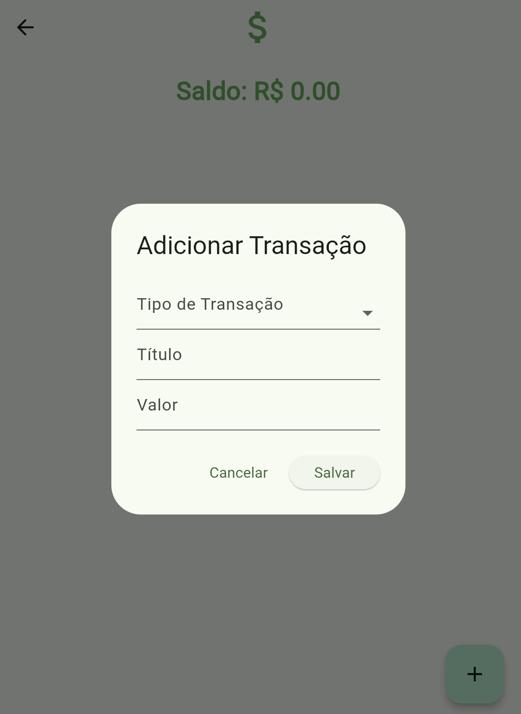
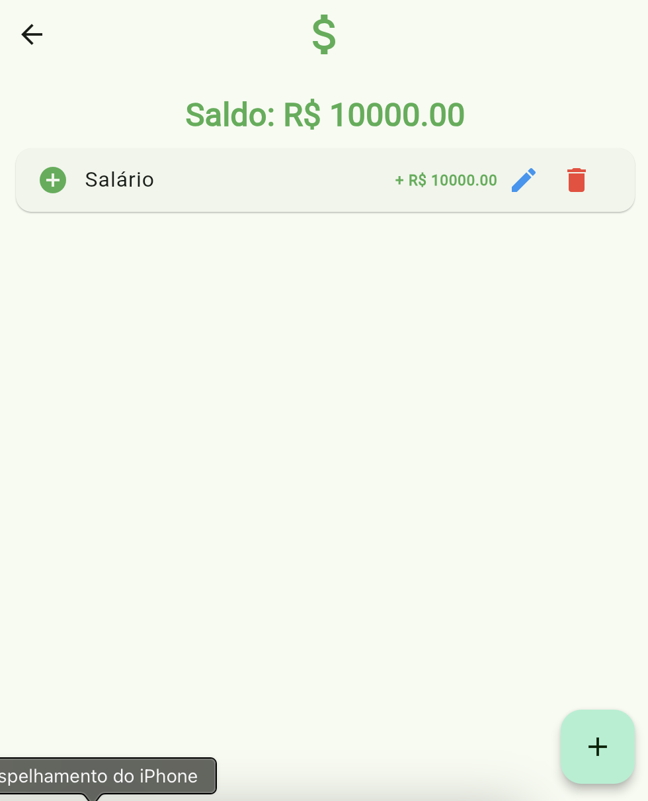
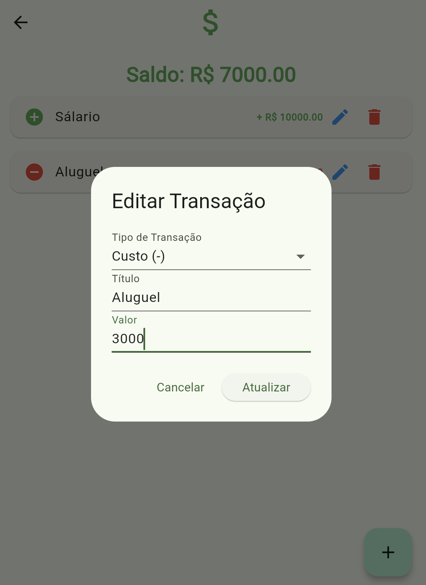

# N2 - Desenvolvimento Mobile 📱

Finances app é um aplicativo desenvolvido com o intuido de possibilitar o controle financeiro total pelo usuário. 
O app possibilita o cadastramento de transações financeiras e atualização imediata do saldo do usuário.

- Tela inicial


- Cadastramento de transação
  


- Listagem de transações
  


- Processo de edição
  


- Paleta utilizada
  


## Como instalar

- Clone o repositório e entre no diretório raiz

```consle
git clone https://github.com/danielfercope/ControlFinanceFlutter.git
```

Versão do **Flutter** e **Dart**
`Flutter 3.24.0 • channel stable • https://github.com/flutter/flutter.git
Framework • revision 80c2e84975
Engine • revision b8800d88be
Tools • Dart 3.5.0 • DevTools 2.37.2`


- Inicialize seu emulador ou utilize a versão web

- Utilizando o emulador:

```console
emulator -avd {virtual_device_name}
```

- Execute o comando flutter devices e selecione o emulador

```console
flutter devices
```

- Se o emulador estiver rodando, selecione Android SDK.
  Ou selecione a versão web.

- Execute o comando flutter run

```console
flutter run
```
